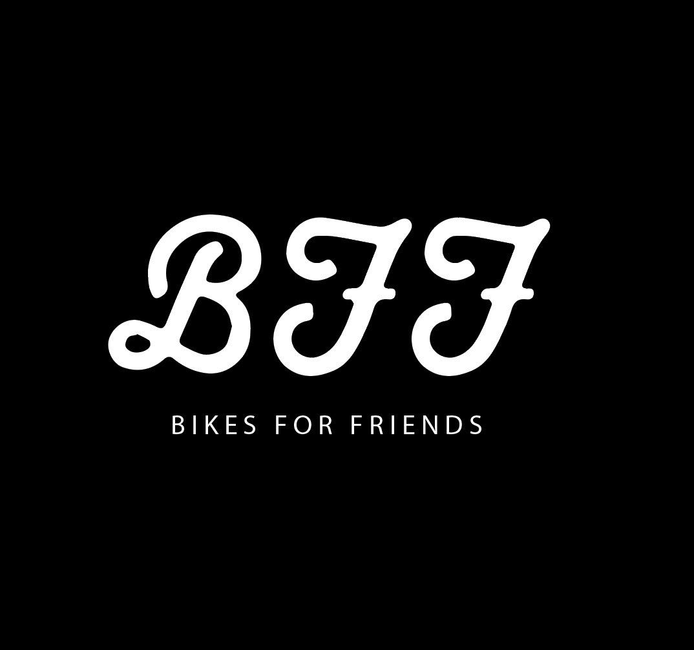
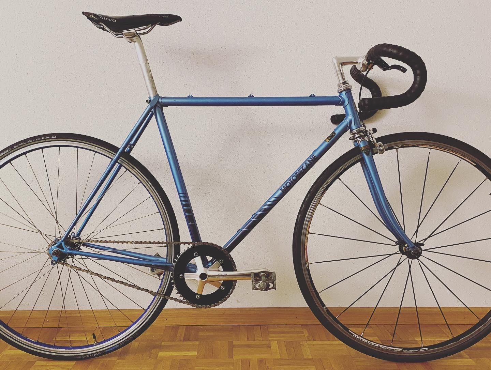
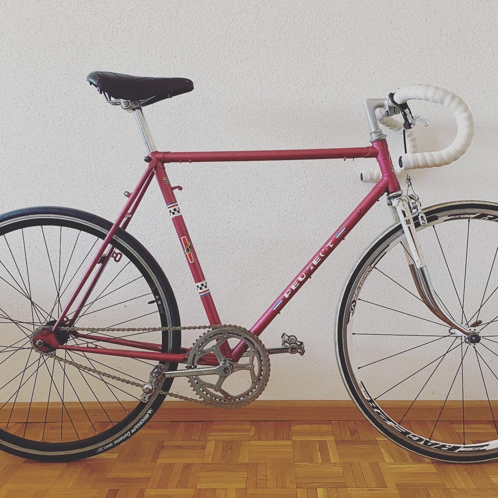
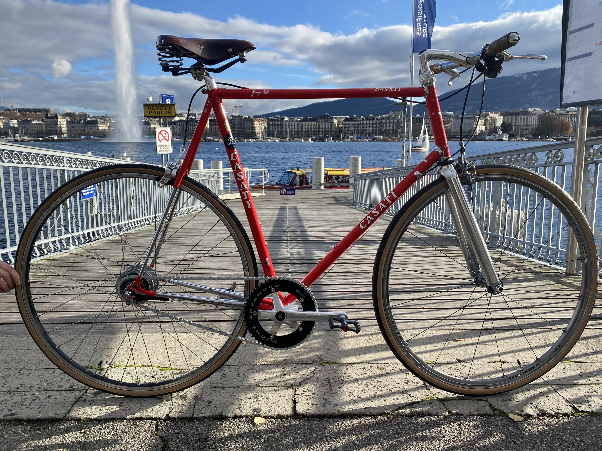
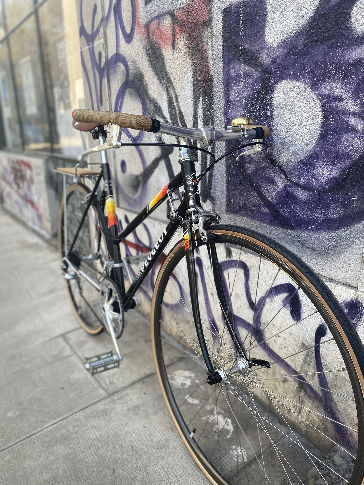
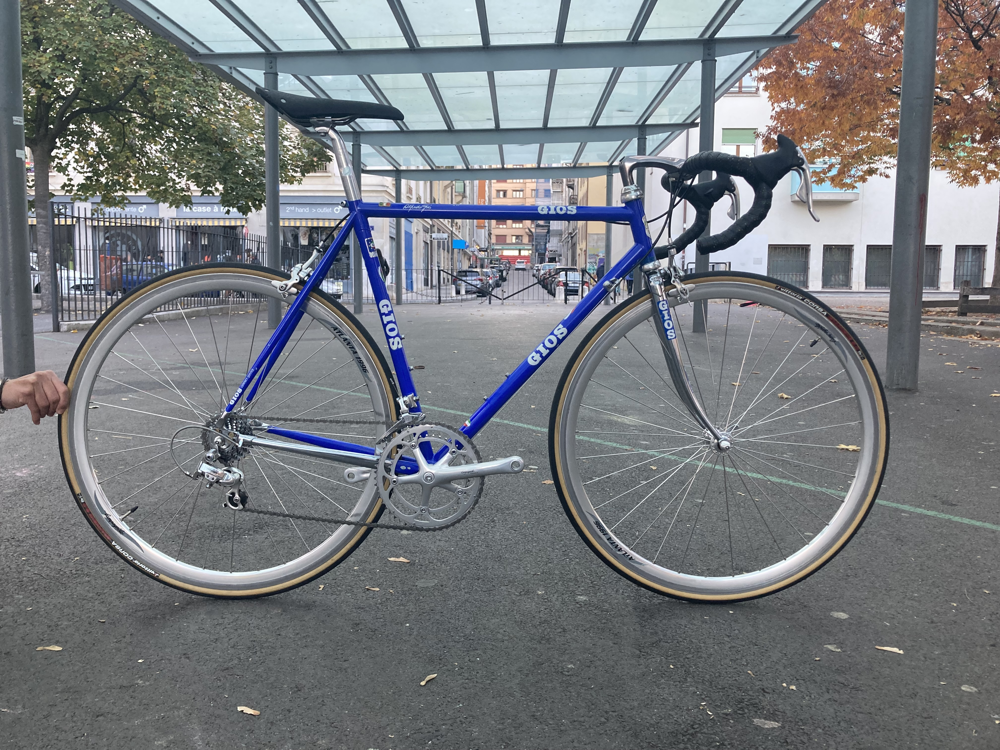
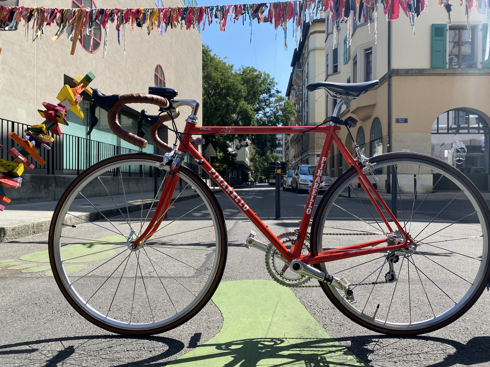
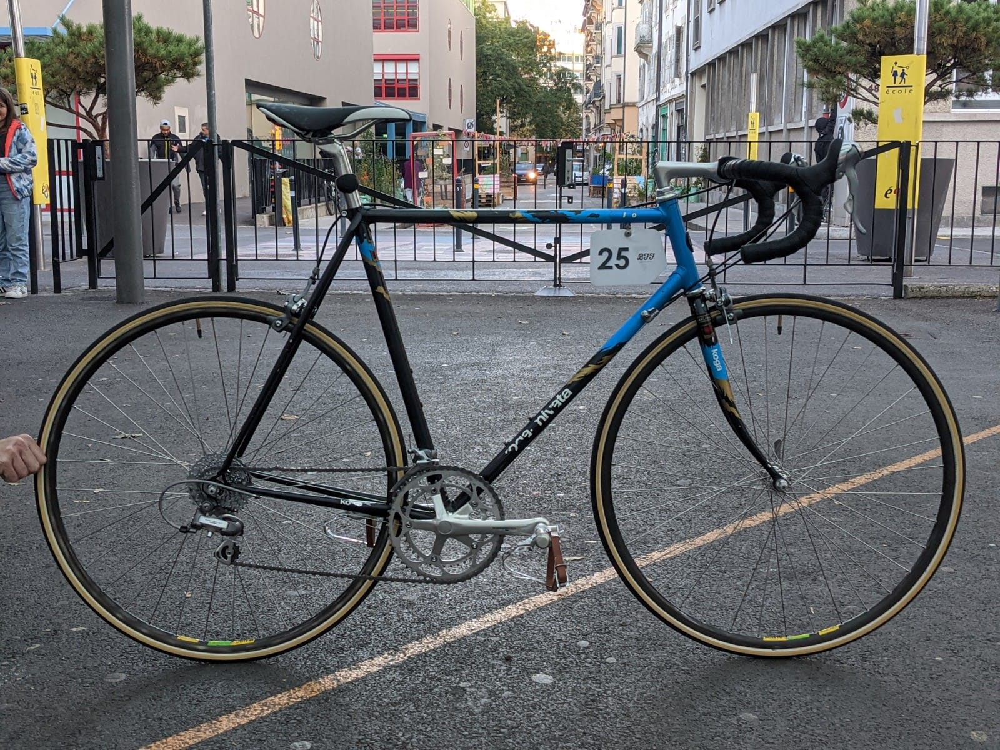
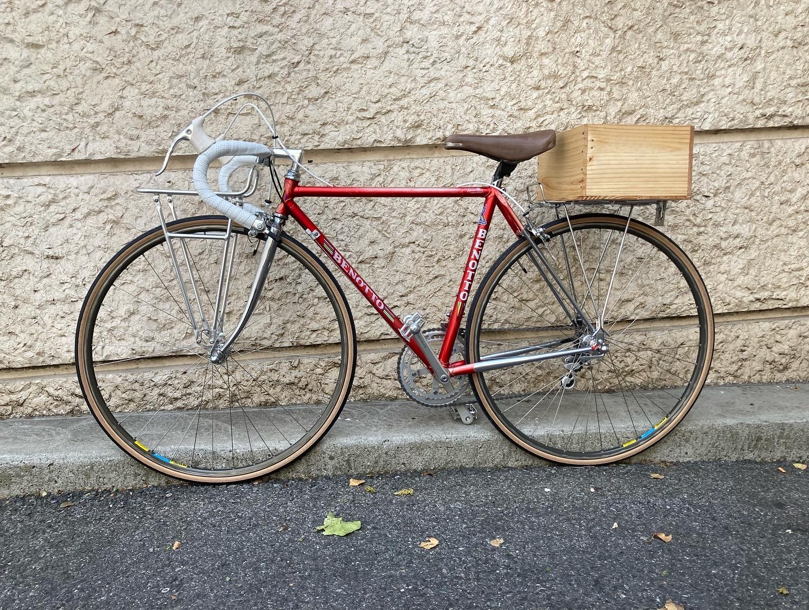

$$\\[0.1cm]$$
*I restore vintage bikes in my spare time!*

$$\\[0.1cm]$$

$$\\[0.1cm]$$

# Blue Jean Baby

$$\\[0.1cm]$$

I have always ridden bikes and I have long been fascinated by how things work, you can see some of my work below. Once I moved to Geneva I started noticing the amount of nice vintage bikes and parts around, so I (mostly) build myself a single speed bike from a vintage frame I bought in a record store (out of all places)...

$$\\[0.1cm]$$

$$\\[0.1cm]$$

*But once the pandemic hits, things started to get more serious (since there was nothing else to do).*

$$\\[0.1cm]$$

# Frankeugeot

$$\\[0.1cm]$$

This is a junkyard build, meaning I found almost all the parts used in the bicycle junkyard of Geneva. It is a Peugeot frame from the late 1970s turned into a single-speed bike. It is a mix and match of parts and colors, but it does look good. This bike is super fast (because of the high gear ratio) and it feels like a real vintage track back when riding it.

$$\\[0.1cm]$$

$$\\[0.1cm]$$

# Olmost

$$\\[0.1cm]$$

This is a late 1980s Olmo Grand Prix frame turned into a classy single speed bike. This bike has a smaller crank plate and wider tires than what I usually put on my bikes, but this makes it a perfect city bike!

$$\\[0.1cm]$$

$$\\[0.1cm]$$

# Kozmic Blues

$$\\[0.1cm]$$

This is a 1980-84 Pinarello Treviso SL frame first build by Bernard Vifian, a legendary Swiss bike racer from the late 1960s early 1970s who soon after opened Vifian Cycles in Geneva. I found a used, but almost complete, 1997 Campagnolo Record Titanium groupset (and within my small budget) and could not resist. On top of I found a beautiful matching set of Ambrosio Futura wheels with Campagnolo Record Titanium hubs. A Turbo vintage bike seat from Selle Italia brings everything together to finish up the bike.

$$\\[0.1cm]$$

$$\\[0.1cm]$$

# Grinch

$$\\[0.1cm]$$

The GRINCH is ready to roll. This is an early 1980s Mercier frame found at in the corner of my favorite place in Geneva, the bike junkyard. It was a little beaten up, but it had to be saved. So, I transformed it into a ‘rat bike’ perfect for commuting fast around town.

$$\\[0.1cm]$$

$$\\[0.1cm]$$

# Ziggy Stardust

$$\\[0.1cm]$$

This is my 1980 Alan Super Record frame with a set of Mavic Aksium wheels, Miche Pistard crankset, and a slick San Marco seat. If anyone ever tells you they will sand and polish an aluminum frame by hand, please discourage them very much ... but the bare aluminum look is awesome!

$$\\[0.1cm]$$

$$\\[0.1cm]$$

# Purple Haze

$$\\[0.1cm]$$

This bike is built on an early 1990s TVT Carbon HM frame, its’ colors scream 1990s. TVT was an incredible bike manufacturer that in the late 1980s won a couple Tours de France disguised as other bike brands. Greg LeMond also won the 1990 Tour de France in a colorful TVT bike. Although this was originally a road bike, I rebuilt it as a hybrid bike perfect for commuting or going on longer rides. It is a light, reliable and fast bike that can be enjoyed everyday for the next 30 years.

$$\\[0.1cm]$$

$$\\[0.1cm]$$

# Angie

$$\\[0.1cm]$$

ANGIE is a mid 1980s Tommasini Super Prestige from my personal colletion that rides and looks incredible, a real eye turner, The frame is made out of Columbus SPX tubing and has the awesome splatter paint job vintage Tommasinis’ are known for. The bike was in storage for a long long time, so it was very dirty and rusty. After taking the bike apart and cleaning every single part, it came out amazing and turned out to be in excellent conditions (wish I had before and after pictures). The bike is assembled with a Campagnolo Super Record groupset (except headset and break levers which are first generation Campagnolo C Record), Mavic Special service de courses wheelset, Cinelli stem and handlebar alongside a gorgeous San Marco Concor Prestige vintage seat. I will let ANGIE lead you anywhere it wants to...

$$\\[0.1cm]$$

$$\\[0.1cm]$$

# Lutite

$$\\[0.1cm]$$

I got this 1990 Pinarello Asolo in Italy this summer and it was in bad shape... So I took it completely apart, cleaned, and reassembled it with the original Campagnolo Athena groupset, Mavic MA40 wheels, and other goodies including a beautiful Velo Orange seat. This bike has many scars, but they are just part of its history and beauty. And, at the end of the day, it is another vintage Pinarello that is back on the streets for many more rides.

$$\\[0.1cm]$$

$$\\[0.1cm]$$

# Cadi

$$\\[0.1cm]$$

I would like to proudly introduce to you Cadi! Cadi is an early 1990s Casati Monza SLX frame I had for awhile now. I finally found a barely used Shimano Nexus 8 speed internal gear back wheel (yes it has gears) and decided to build a gorgeous city cruiser. The result is this awesome bike that rides like a brand new Cadillac (hence the name).

$$\\[0.1cm]$$

$$\\[0.1cm]$$

# Roxanne

$$\\[0.1cm]$$

Sometimes a BFF asks for a cool vintage bike, so they get the coolest! Meet Roxanne, no red light needed. This is a 1985 Peugeot PH65 frame (the famous 103 carbolite tubing). I built this bike to last with a mix of great vintage parts. The beautiful wooden rack and a recycled bike bag make this a perfect ride for city commuting (or going anywhere really).

$$\\[0.1cm]$$

$$\\[0.1cm]$$

# Bohémien

$$\\[0.1cm]$$

Meet Bohémien a late 1970s/1980s Geneva made bike built by the Jean Brun cycle shop. It is a Reynolds 531 frame fully assembled with Campagnolo parts and a gorgeous brooks vintage seat. The bike was completely taken apart, cleaned and rebuilt, and now it is ready for a Tour du Lac!

$$\\[0.1cm]$$

$$\\[0.1cm]$$

# Giovanna

$$\\[0.1cm]$$

Giovanna is a 1996 GIOS Compact Pro assembled with a pristine (and complete) 1996 Campagnolo Chorus 8 speed groupset, Atlanta 1996 rims, new old stock Chorus pedals from the late 1980s, 3TTT handlebar and stem, San Marco Regal saddle, Vittoria corsa tires and Cinelli handlebar tape ...

$$\\[0.1cm]$$

$$\\[0.1cm]$$

# Pinelvio

$$\\[0.1cm]$$

Yet another vintage Pinarello ...️ This time it is a 1994 Pinarello Stelvio frame assembled with 2008 Campagnolo Centaur Groupset and other goodies, just an awesome ride! I will let the pictures do the rest of the talking ...

$$\\[0.1cm]$$

$$\\[0.1cm]$$

# Kogamon

$$\\[0.1cm]$$

Meet Kogamon! This is a 1990 Koga Miyata Pro frame assembled with a full Shimano 600 groupset️. The pictures do not do justice to how good this bike looks and, specially, how incredible it rides (it even has a custom made, vintage, race plate).

$$\\[0.1cm]$$

$$\\[0.1cm]$$

# Red

$$\\[0.1cm]$$

Very cool new project ready for spring. It all started with a 1980s Mazza race frame (Geneva based bike builder) to be transformed into a city friendly commuter bike️. This beauty got straight handlebars, thumb shifters, and awesome red tires. To top it all off, the handlebar and seat post have integrated lights on them.

$$\\[0.1cm]$$

$$\\[0.1cm]$$

# Layla

$$\\[0.1cm]$$

Meet Layla, the newest vintage BFF out there. Layla was built to be an all around touring bike, ready for the daily commute and the weekend road trip. This beautiful ride was assembled from a 1984 Benotto frame and was equipped with a vintage Shimano 600 groupset️. To top it all off, Layla comes with super cool bar end shifters and a versatile wine crate.

$$\\[0.1cm]$$

$$\\[0.1cm]$$

# Mercky

$$\\[0.1cm]$$

Just my personal Eddy Merckx MX Leader built with a Campagnolo Record 8 speed groupset riding through the sunset ...

$$\\[0.1cm]$$

$$\\[0.1cm]$$

# Mazzaff

$$\\[0.1cm]$$

Not my usual build but this one is on 🔥 1994 Mazza (Geneva made) Team frame neoretro style with a brand new Campagnolo Centaur groupset and Siricco wheelset. How do you retrofit?

$$\\[0.1cm]$$

