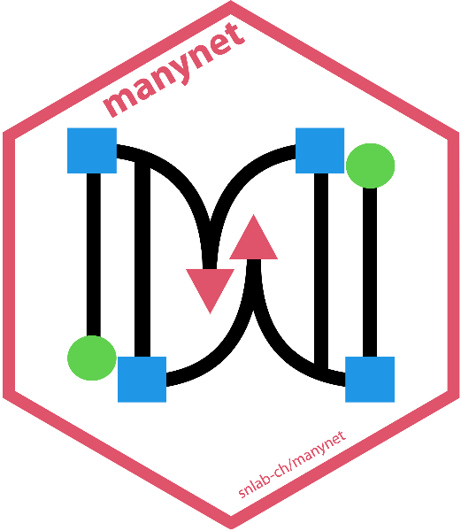
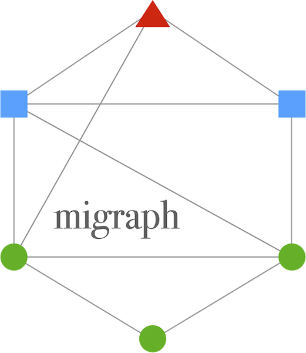
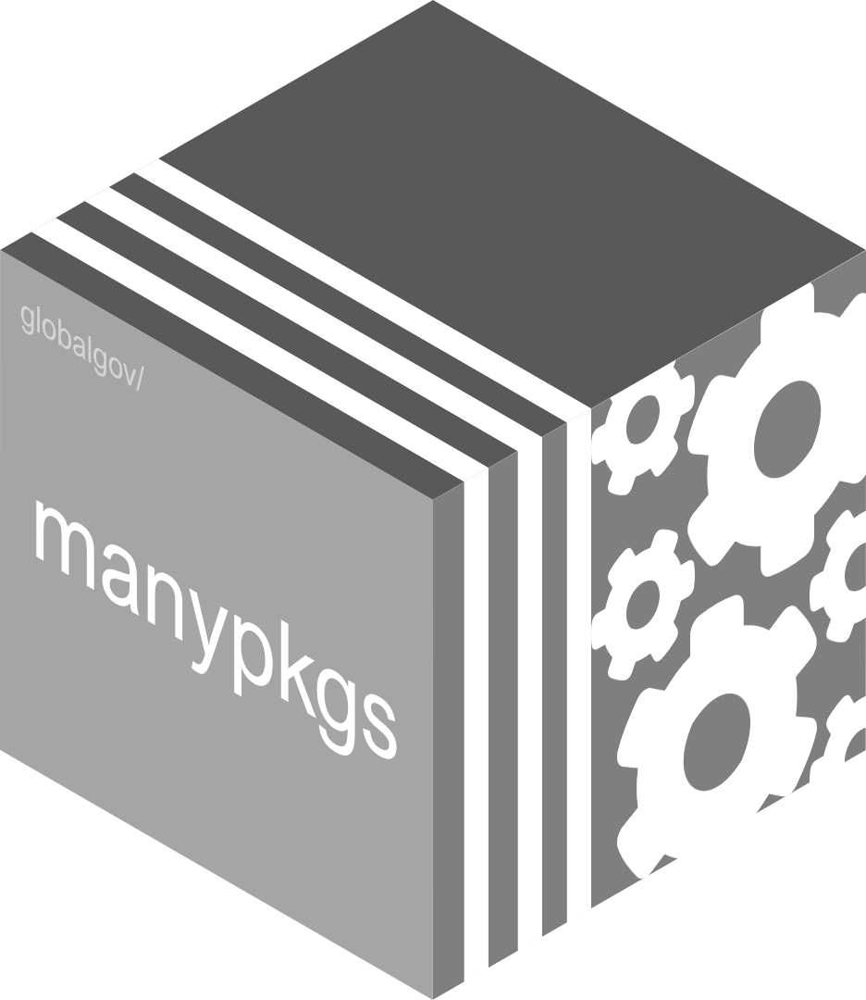

<html>
  
</html>

$$\\[0.1cm]$$
</style>

*I actively contribute to the development and maintenance of many R packages, 
below are a few of them:*

$$\\[0.1cm]$$

</style>

[poldis](https://github.com/henriquesposito/poldis) - An R package with tools for analyzing political discourses over time

$$\\[0.1cm]$$

</style>

[messydates](https://globalgov.github.io/messydates/) - An R package for Extended Date/Time Format (EDTF)

$$\\[0.1cm]$$

</style>

[manydata](https://manydata.ch) - An R portal for global governance data

$$\\[0.1cm]$$

</style>

[manynet](https://snlab-ch.github.io/manynet/) - An R package to make, manipulate, and map myriad networks

$$\\[0.1cm]$$

</style>

[migraph](https://snlab-ch.github.io/migraph/) - An R package with tools for multimodal and multilevel network analysis

$$\\[0.1cm]$$

</style>

[manypkgs](https://globalgov.github.io/manypkgs/) - An R package for supporting the creation of new many packages

$$\\[0.1cm]$$

</style>

## [And much more!](https://github.com/henriquesposito)

